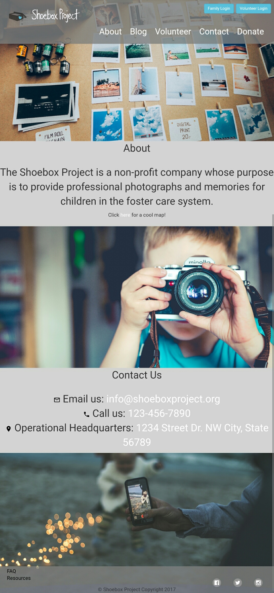
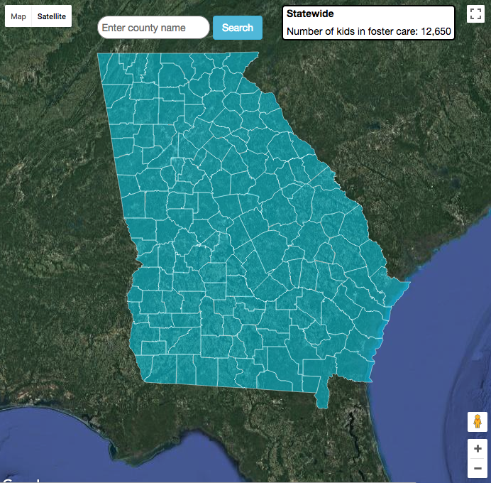
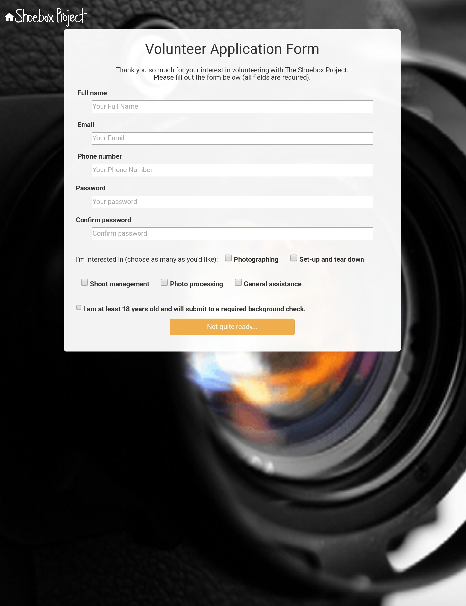
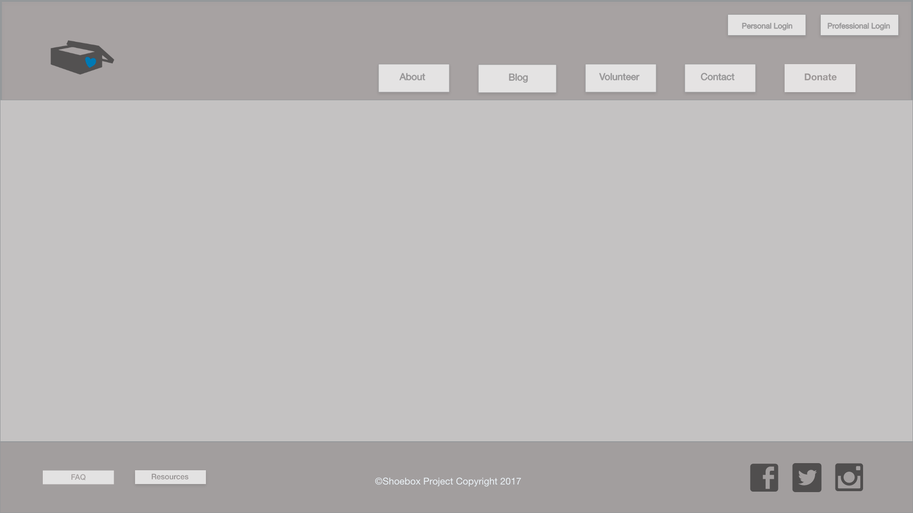
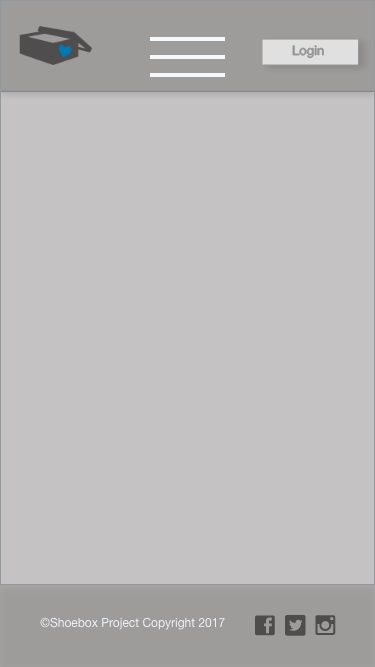
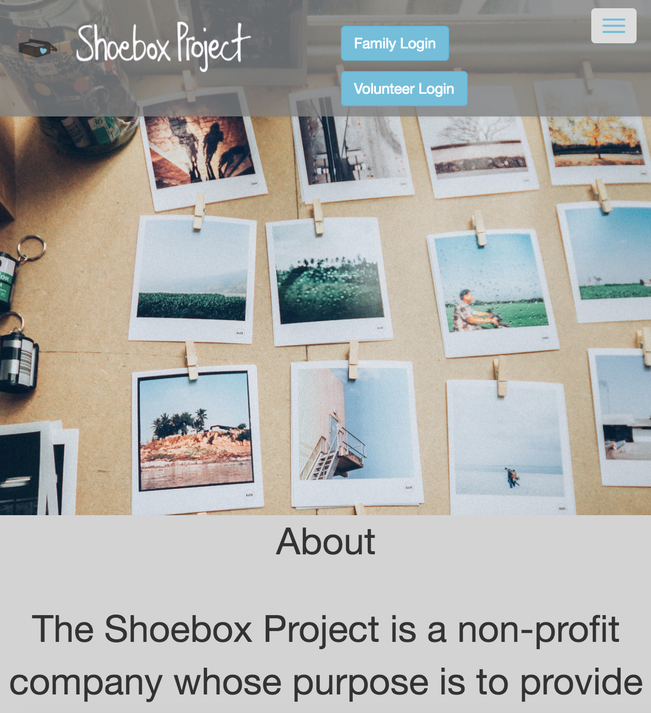

## Overview:
The Shoebox Project is a non-profit company whose purpose is to provide professional photographs and memories for children in the foster care system. We set up a site for the company, including sign-up forms, login capabilities, an interactive map, and various pages to navigate to on the site.


## Github Link:
[The Shoebox Project GitHub](https://github.com/ValerieThoma/baby-unicorns)

## Team Members & Roles:
* [Allyson Conrad](https://github.com/allysonc1)
**Scrum Master/Birthday Girl/Developer**
* [Valerie Jane Thoma](https://github.com/ValerieThoma)
**Designer/Class Clown/Developer**
* [Eddie Atkinson](https://github.com/eddieatkinson)
**Data Wrangler/Map Magician/Developer**
* [Amir Patel](https://github.com/Amirpatel89)
**New Kid on the Block**


## Technologies used:
**Languages:**
* JavaScript
* HTML5
* CSS

**Frameworks:**
* jQuery
* Bootstrap

**Other:**
* Adobe XD - wireframe
* Google Maps API
* County location data from [CivicDashboards](http://catalog.civicdashboards.com)

## Code snippets:
County data displayed when hovered...
``` javascript
function mouseInToRegion(e) {
    // set the hover state so the setStyle function can change the border
    e.feature.setProperty('state', 'hover');
    $('#data-label').css('color', 'black');

    // Get county name from JSON and format it to match data in counties array
    var countyNameFromJson = e.feature.getProperty('name');
    var countyNameAsArray = countyNameFromJson.split(" County");
    var countyNameOnlyArray = countyNameAsArray.splice(0, 1);
    var countyNameOnlyString = countyNameOnlyArray.toString();

    // Search for county and display number of children in foster care
    $('#data-label').text(countyNameOnlyString);
    for(let i = 0; i < counties.length; i++){
        if(counties[i].county == countyNameOnlyString){
            $('#data-value').text(counties[i].childrenInFosterCare);
        }
    }
}
```
...and when searched.
``` javascript
    // Start with statewide data in display
    $('#data-label').html(counties[counties.length - 1].county);
    $('#data-value').html(counties[counties.length - 1].childrenInFosterCare);

    $('#county-search-form').submit(function(event){
        event.preventDefault();
        $('#data-label').css('color', 'black');
        var userSearch = $('#county-input').val();
        var matchFound = false
        // Check for match, ignoring case
        for(let i = 0; i < counties.length; i++){
            if(counties[i].county.toLowerCase() === userSearch.toLowerCase()){
                $('#data-label').html(counties[i].county);
                $('#data-value').html(counties[i].childrenInFosterCare);
                matchFound = true;
                var fullNameOfJsonCounty = counties[i].county + ' County, GA';
            }
        }
        // If no matching counties...
        if(!matchFound){
            $('#data-label').css('color', 'red');
            $('#data-label').html("No counties match your search.");
            $('#data-value').html("");
        }
    });

    // Autocomplete
    // Build array to search
    var countyNames = [];
        for(let i = 0; i < counties.length; i++){
            countyNames.push(counties[i].county);
        }

    // Search to enable automplete
    $( "#county-input" ).autocomplete({
      source: function( request, response ) {
              var matcher = new RegExp( "^" + $.ui.autocomplete.escapeRegex(request.term), "i");
              response( $.grep( countyNames, function( item ){
                  return matcher.test( item );
              }) );
          }
    });
```
Local storage used for authentication 
``` javascript
$(document).ready(()=>{

    // store input data from user signup screen in localStorage
    
        // create an object to put the data into

        var userObj = {
            userType :  [],
            fullName : [],
            userPhone : [],
            userEmail : [],
            passwd : [],
            signupDate : []
        }
        userObj.signupDate = new Date();    // get the date and put it into the object

        $('.user-sign-up-form').submit((event)=>{
            event.preventDefault();

            // get the passwords that were entered on the screen:

            var password = $('.password').val();    
            var passwordConfirm = $('.password-confirm').val();

            // get the number of stored users from the site's localStorage 

            var numUsers = localStorage.getItem('users-signedup')
            
            if(password != passwordConfirm){
                console.log(password);
                console.log($('.password-confirm').val());
                $('.password-error').html("Your passwords do not match.");
            }else{
                console.log("passwords match")
                
                // if the number of users is null, set the number to 1

                if(numUsers == null){
                    numUsers = 1;
                    console.log("numUsers is null",numUsers)
                }else{
                    numUsers++;     // increment the number of users objects stored in localStorage
                }
                
                // set the new number of users in localStorage

                localStorage.setItem('users-signedup',numUsers)

                // put the new data entered by the user into the object

                userObj.userType= 'Family';
                userObj.fullName = $('.full-name').val();
                userObj.userPhone = $('.phone').val();
                userObj.userEmail = $('.email').val();
                userObj.passwd = $('.password').val();

                // store the data in localStorage with a number at the end of the field name

                localStorage.setItem("userType"+numUsers, userObj.userType);
                localStorage.setItem("password"+numUsers, userObj.passwd);
                localStorage.setItem("fullName"+numUsers, userObj.fullName);
                localStorage.setItem("userEmail"+numUsers, userObj.userEmail);
                localStorage.setItem("userPhone"+numUsers, userObj.userPhone);
                localStorage.setItem("signupDate"+numUsers, userObj.signupDate);

                // bring up the user page

                window.location.href = "user_home.html"
                
            }
        });
        
    }); 
```
``` javascript
    //  to access the localStorage when a user logs in:

        // get the number of users stored in localStorage

        var numUsers = localStorage.getItem('users-signedup')

        //  get the data the user entered on the login page

        var enteredEmail = $('.email').val();
        var enteredPassword = $('.password').val();

        for (i=1; i <= numUsers; i++){      // loop through the sets of data in localStorage

            // retrieve the emails and passwords until a match is found or the data ends

            userObj.passwd = localStorage.getItem('password'+i)
            userObj.userEmail = localStorage.getItem('userEmail'+i)
```
```script
wrote a bash script to login to the ubuntu aws site and named it awscript, and put it in the directory
that my terminal opens into so it changes the directory automatically and then logs in\

cd desktop/digitalcrafts
sudo ssh -i 'alsawskeys.pem' ubuntu@ec2-18-221-235-147.us-east-2.compute.amazonaws.com
```
``` 
to run this script, open a terminal and run:

sh awscript 
```
## Screenshots:



Landing page wireframe created in Adobe XD

Landing page on mobile, desired layout though not fully realized. 


Mobile layout still in testing stages


## Contributing:
1. Allow project administrator (and/or volunteers) to upload photos and documents.
2. Give users ability to access photos. 
3. Add a "donate" button for charitable-feeling site visitors.

## URL:
[The Shoebox Project](http://www.eddiebatkinson.com/shoeboxproject)

## Project History:
10/18/2017 - Project Start